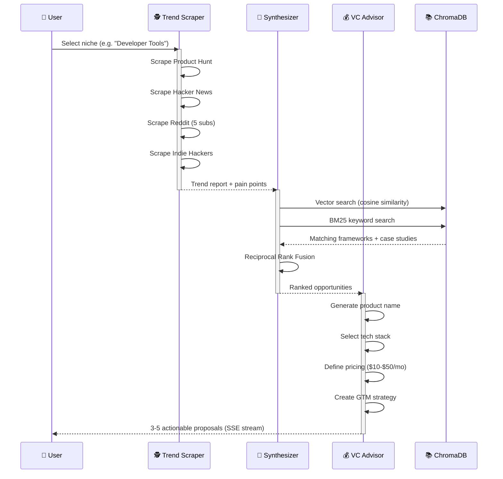
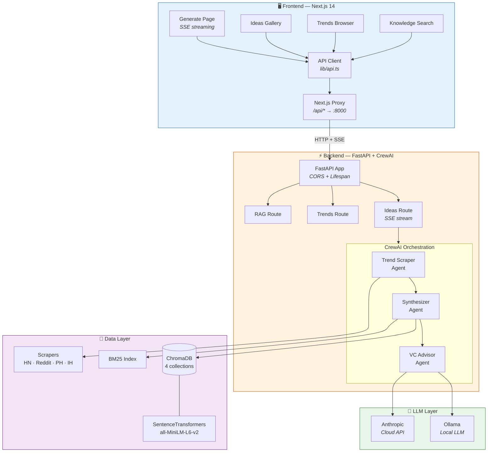
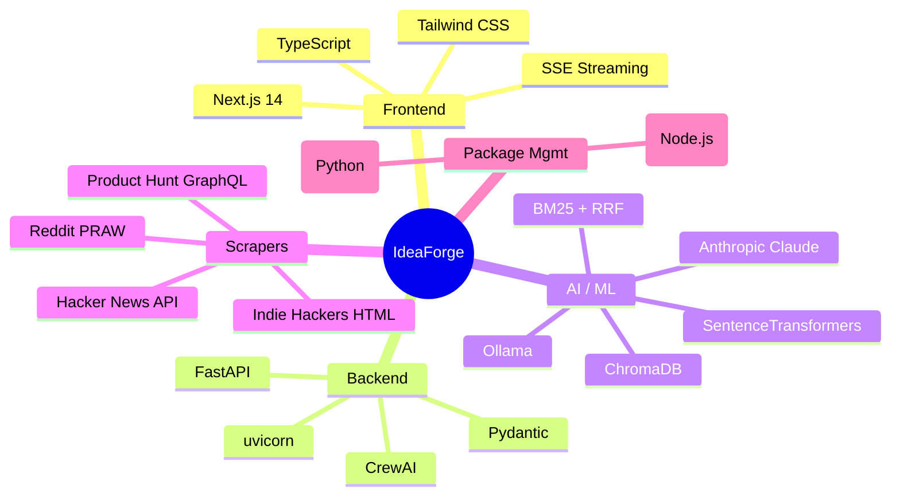
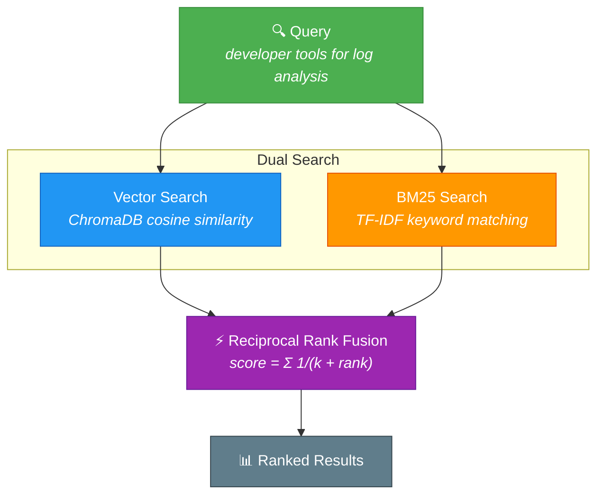
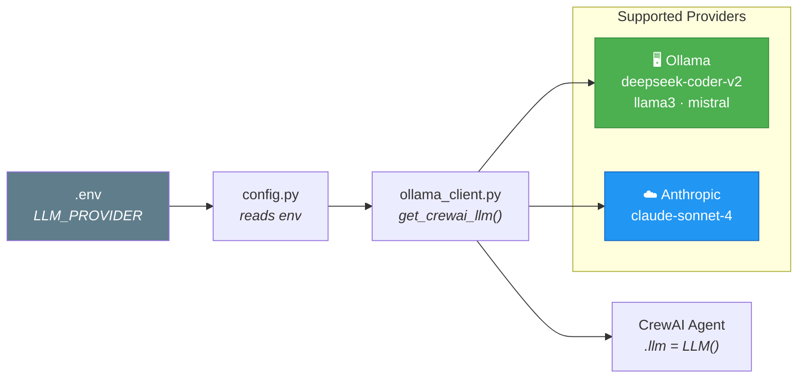

<p align="center">
  
</p>

<p align="center">
  <strong>Multi-Agent Micro-SaaS Idea Discovery Engine</strong><br>
  <em>Scrape trends. Match with data. Generate business proposals.</em>
</p>

<p align="center">
  
  
  
  
  
  
</p>

<p align="center">
  <a href="#-quick-start">Quick Start</a> &bull;
  <a href="#-how-it-works">How It Works</a> &bull;
  <a href="#-architecture">Architecture</a> &bull;
  <a href="#-api">API</a> &bull;
  <a href="#-troubleshooting">Troubleshooting</a>
</p>

---

## What is IdeaForge?

IdeaForge is an **AI-powered multi-agent system** that discovers monetizable micro-SaaS ideas by combining real-time trend scraping, RAG-based knowledge matching, and autonomous business proposal generation.

> **3 AI agents working 24/7** — one watches the market, one cross-references the data, and one writes the business plan.

<p align="center">
  
  
  
</p>

---

## How It Works

```mermaid
flowchart LR
    subgraph INPUT["🎯 User Input"]
        A[Niche Selection<br/>e.g. "Developer Tools"]
    end

    subgraph AGENTS["🤖 CrewAI Multi-Agent Pipeline"]
        B["🕵️ Trend Scraper<br/><i>Scrapes 4 sources</i>"]
        C["🧠 Synthesizer<br/><i>RAG gap analysis</i>"]
        D["💰 VC Advisor<br/><i>Business proposals</i>"]
    end

    subgraph SOURCES["📡 Data Sources"]
        E[Product Hunt<br/>GraphQL API]
        F[Hacker News<br/>Firebase API]
        G[Reddit<br/>PRAW + 5 subs]
        H[Indie Hackers<br/>HTML Scraping]
    end

    subgraph RAG["📚 Knowledge Base"]
        I[(ChromaDB<br/>Vector Store)]
        J[BM25<br/>Keyword Search]
        K[7 Monetization<br/>Frameworks]
        L[20 Pain<br/>Points]
        M[12 Case<br/>Studies]
    end

    subgraph OUTPUT["📄 Output"]
        N[3-5 Actionable<br/>Micro-SaaS Proposals]
    end

    A --> B
    B --> C --> D
    E & F & G & H --> B
    I & J & K & L & M --> C
    D --> N

    style A fill:#4CAF50,stroke:#388E3C,color:#fff
    style B fill:#2196F3,stroke:#1565C0,color:#fff
    style C fill:#FF9800,stroke:#E65100,color:#fff
    style D fill:#9C27B0,stroke:#6A1B9A,color:#fff
    style N fill:#4CAF50,stroke:#388E3C,color:#fff
```

### Pipeline Flow



---

## Architecture



---

## Tech Stack



---

## Quick Start

### Prerequisites

| Requirement | Check | Install |
|-------------|-------|---------|
| Python 3.11+ | `python3 --version` | [python.org](https://python.org) |
| Node.js 18+ | `node --version` | [nodejs.org](https://nodejs.org) |
| uv | `uv --version` | `curl -LsSf https://astral.sh/uv/install.sh \| sh` |
| Ollama | `ollama --version` | [ollama.ai](https://ollama.ai) |

### 1. Clone & Setup

```bash
git clone https://github.com/soumyachk101/IdeaForge.git
cd IdeaForge

# Backend setup
cd backend
cp .env.example .env
uv sync
```

### 2. Seed the Knowledge Base

```bash
cd backend
uv run python -m rag.ingest
```

```
Ingesting seed data...
  monetization_frameworks: 7 documents, 7 chunks
  pain_points: 12 documents, 12 chunks
  startup_case_studies: 7 documents, 7 chunks
Done! Total: 26 documents in 3 collections
```

### 3. Start Everything

```bash
# Terminal 1 — Backend
cd backend
uv run uvicorn api.main:app --reload --host 127.0.0.1 --port 8000

# Terminal 2 — Ollama
ollama pull deepseek-coder-v2
ollama serve

# Terminal 3 — Frontend
cd frontend
npm install && npm run dev
```

### 4. Generate Ideas

Open **http://localhost:3000** → Select a niche → Click **Generate Ideas** → Watch the 3 agents work in real-time via SSE streaming.

---

## API

```mermaid
graph LR
    subgraph ENDPOINTS["REST API Endpoints"]
        direction TB
        H["GET /api/health"]
        S["GET /api/stats"]
        IG["POST /api/ideas/generate<br/><i>SSE stream</i>"]
        IL["GET /api/ideas"]
        IID["GET /api/ideas/:id"]
        TL["GET /api/trends"]
        TS["POST /api/trends/scrape"]
        RQ["POST /api/rag/query"]
        RI["POST /api/rag/ingest/seed"]
        RB["GET /api/rag/browse/:collection"]
        DOC["GET /docs<br/><i>Swagger UI</i>"]
    end

    style H fill:#4CAF50,color:#fff
    style S fill:#4CAF50,color:#fff
    style IG fill:#2196F3,color:#fff
    style IL fill:#2196F3,color:#fff
    style IID fill:#2196F3,color:#fff
    style TL fill:#FF9800,color:#fff
    style TS fill:#FF9800,color:#fff
    style RQ fill:#9C27B0,color:#fff
    style RI fill:#9C27B0,color:#fff
    style RB fill:#9C27B0,color:#fff
    style DOC fill:#607D8B,color:#fff
```



### Generate Ideas (SSE Stream)

```bash
curl -N -X POST http://127.0.0.1:8000/api/ideas/generate \
  -H "Content-Type: application/json" \
  -d '{"niche": "developer tools"}'
```

```
data: {"type":"start","niche":"developer tools","id":"a1b2c3d4"}
data: {"type":"result","id":"a1b2c3d4","content":"## LogLens AI\n\n### The Problem\n..."}
data: {"type":"done","id":"a1b2c3d4"}
```

### Search RAG Knowledge Base

```bash
curl -X POST http://127.0.0.1:8000/api/rag/query \
  -H "Content-Type: application/json" \
  -d '{"query": "developer tools for log analysis", "collection": "all"}'
```

---

## Knowledge Base (RAG)

### Hybrid Retrieval Pipeline



### Seed Data

| Collection | Docs | Description |
|------------|------|-------------|
| `monetization_frameworks` | 7 | Freemium, API-as-a-service, Subscription, etc. |
| `pain_points` | 12 | "I wish there was a tool that..." complaints |
| `startup_case_studies` | 7 | Real micro-SaaS with revenue & tech stacks |

---

## LLM Configuration



---

## Project Structure

```
IdeaForge/
│
├── backend/                          # Python backend
│   ├── pyproject.toml                # Dependencies & project config
│   ├── .env.example                  # Environment variables template
│   ├── config.py                     # Centralized configuration
│   ├── main.py                       # CLI: serve | ingest | generate | scrape
│   │
│   ├── agents/                       # CrewAI 3-agent pipeline
│   │   ├── crew.py                   #   └─ Orchestrates sequential flow
│   │   ├── trend_scraper.py          #   └─ Agent 1: scrapes 4 sources
│   │   ├── synthesizer.py            #   └─ Agent 2: RAG gap analysis
│   │   └── vc_agent.py               #   └─ Agent 3: business proposals
│   │
│   ├── scrapers/                     # Data source scrapers
│   │   ├── base.py                   #   └─ TrendData model + BaseScraper
│   │   ├── hacker_news.py            #   └─ HN Firebase API
│   │   ├── reddit.py                 #   └─ PRAW (5 subreddits)
│   │   ├── product_hunt.py           #   └─ GraphQL API + fallback
│   │   └── indie_hackers.py          #   └─ BeautifulSoup scraping
│   │
│   ├── rag/                          # RAG pipeline
│   │   ├── embedder.py               #   └─ SentenceTransformers (MPS/CPU)
│   │   ├── chroma_client.py          #   └─ ChromaDB (4 collections)
│   │   ├── retriever.py              #   └─ Hybrid vector+BM25+RRF
│   │   ├── ingest.py                 #   └─ Seed data ingestion
│   │   └── seed_data/                #   └─ Pre-built knowledge base
│   │
│   ├── llm/                          # LLM layer
│   │   ├── ollama_client.py          #   └─ Ollama + Anthropic + CrewAI
│   │   └── prompts.py                #   └─ System prompts for agents
│   │
│   ├── tools/                        # CrewAI tools
│   │   ├── scraper_tools.py          #   └─ Scrapers as BaseTool
│   │   └── rag_tools.py              #   └─ RAG as BaseTool
│   │
│   └── api/                          # FastAPI backend
│       ├── main.py                   #   └─ App + CORS + lifespan
│       ├── models.py                 #   └─ Pydantic models
│       └── routes/
│           ├── health.py             #   └─ /api/health, /api/stats
│           ├── ideas.py              #   └─ /api/ideas/generate (SSE)
│           ├── trends.py             #   └─ /api/trends/scrape
│           └── rag.py                #   └─ /api/rag/query, /browse
│
└── frontend/                         # Next.js 14 dashboard
    ├── next.config.ts                # API proxy to :8000
    ├── lib/api.ts                    # API client
    └── app/
        ├── layout.tsx                # Navigation + layout
        ├── page.tsx                  # Generate (SSE streaming)
        ├── ideas/                    # Ideas gallery + detail
        ├── trends/page.tsx           # Trend browser
        └── knowledge/page.tsx        # RAG search + browse
```

---

## Troubleshooting

<details>
<summary><b>"ModuleNotFoundError: No module named 'agents'"</b></summary>

```bash
# Always run from the backend/ directory:
cd IdeaForge/backend
uv run python -m rag.ingest
```
</details>

<details>
<summary><b>"Ollama connection refused"</b></summary>

```bash
# Start Ollama first:
ollama serve
ollama pull deepseek-coder-v2
```
</details>

<details>
<summary><b>"No results from Reddit scraper"</b></summary>

Reddit requires API credentials. Go to https://www.reddit.com/prefs/apps, create a "script" app, and add to `.env`:
```bash
REDDIT_CLIENT_ID=your_client_id
REDDIT_CLIENT_SECRET=your_secret
```
</details>

<details>
<summary><b>"TextEmbedder takes 30+ seconds to load"</b></summary>

First load downloads the model (~80MB). Subsequent loads use cache. Apple Silicon MPS acceleration is auto-detected.
</details>

<details>
<summary><b>"ChromaDB collection not found"</b></summary>

```bash
cd IdeaForge/backend
uv run python -m rag.ingest --reset
```
</details>

<details>
<summary><b>Frontend shows "Failed to fetch"</b></summary>

```bash
# Check backend is running:
curl http://127.0.0.1:8000/api/health

# If not:
cd IdeaForge/backend
uv run uvicorn api.main:app --reload
```
</details>

---

## Environment Variables

| Variable | Default | Description |
|----------|---------|-------------|
| `LLM_PROVIDER` | `ollama` | `"ollama"` or `"anthropic"` |
| `OLLAMA_BASE_URL` | `http://localhost:11434` | Ollama server URL |
| `OLLAMA_MODEL` | `deepseek-coder-v2` | Ollama model name |
| `ANTHROPIC_API_KEY` | — | Only if `LLM_PROVIDER=anthropic` |
| `REDDIT_CLIENT_ID` | — | Reddit API credentials |
| `REDDIT_CLIENT_SECRET` | — | Reddit API credentials |
| `PRODUCT_HUNT_TOKEN` | — | PH GraphQL API token |
| `CHROMA_PATH` | `.ideaforge_data/chroma` | ChromaDB storage path |
| `EMBEDDING_MODEL` | `all-MiniLM-L6-v2` | Sentence-transformers model |
| `API_HOST` | `127.0.0.1` | Backend host |
| `API_PORT` | `8000` | Backend port |

---

## Contributing

1. Fork the repository
2. Create a feature branch: `git checkout -b feature/my-feature`
3. Make your changes
4. Run tests: `cd backend && uv run python -c "from api.main import app; print('OK')"`
5. Submit a pull request

---

## License

MIT License. See [LICENSE](LICENSE) for details.

---

<p align="center">
  <strong>Built with CrewAI, FastAPI, ChromaDB, and Next.js</strong><br>
  <em>Discover your next micro-SaaS idea in minutes, not months.</em>
</p>
