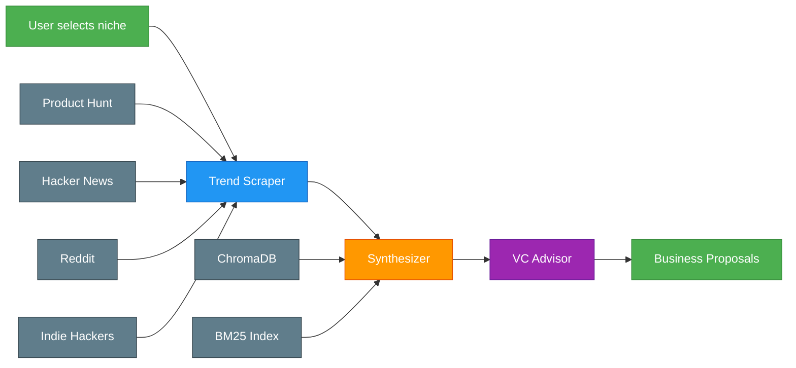
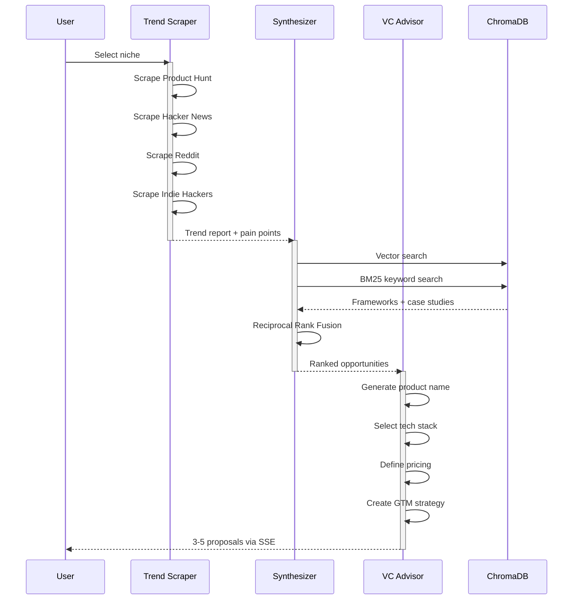
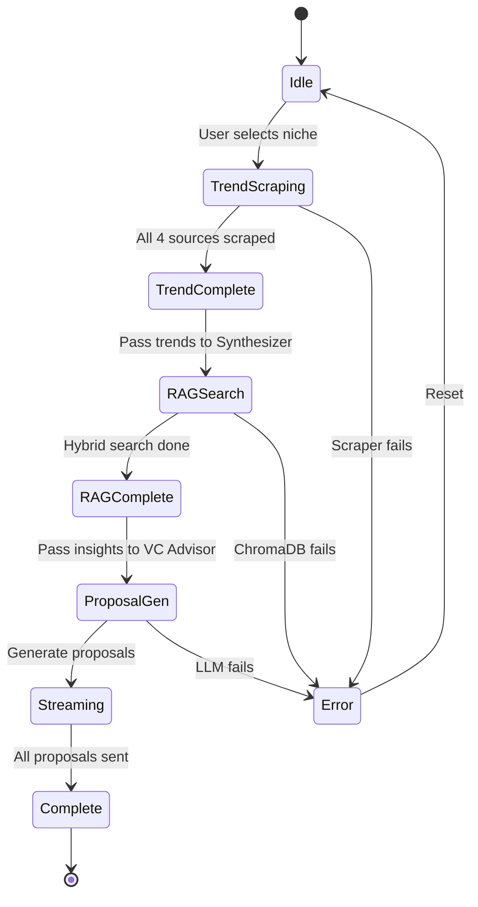
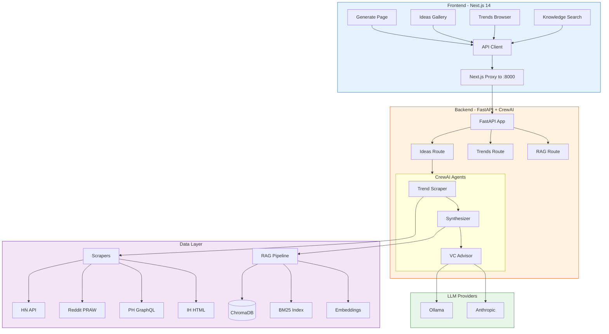
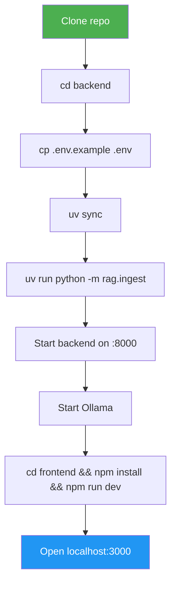
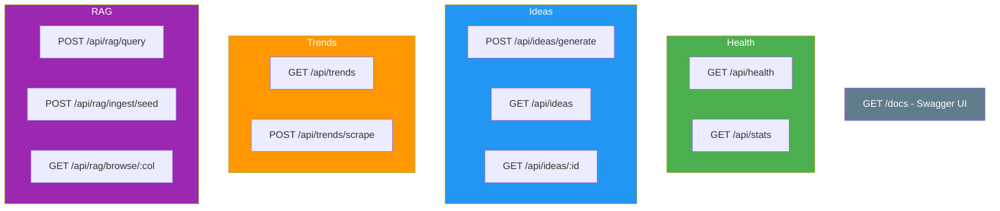
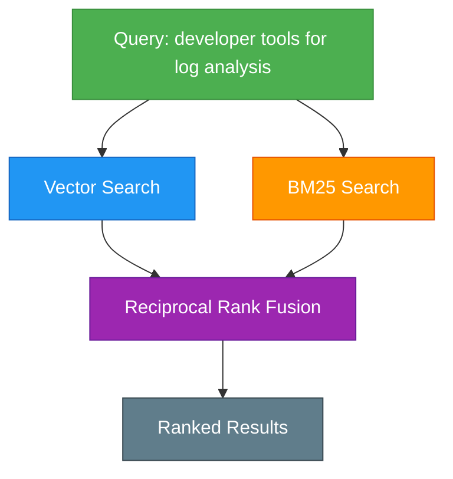
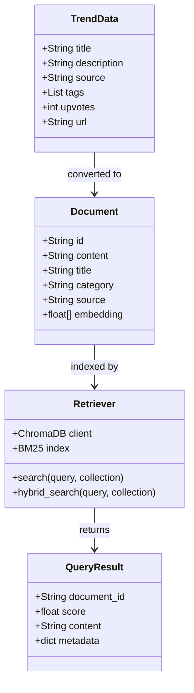
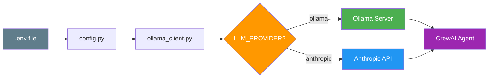

<h1 align="center">
<pre>
 ___                   _____                    
|_  |                 |  ___|                   
  | | __ _  __ _  __ _| |__ _ __ __ _  ___ ___  
  | |/ _` |/ _` |/ _` |  __| '__/ _` |/ __/ _ \ 
  | | (_| | (_| | (_| | |__| | | (_| | (_|  __/ 
  \_/\__,_|\__, |\__,_\____/_|  \__,_|\___\___| 
             __/ |                               
            |___/                                
</pre>
</h1>

<p align="center">
  <strong>Multi-Agent Micro-SaaS Idea Discovery Engine</strong><br>
  <em>Scrape trends. Match with data. Generate business proposals.</em>
</p>

<p align="center">
  
  
  
  
  
  
</p>

<p align="center">
  <a href="#-quick-start">Quick Start</a> &bull;
  <a href="#-how-it-works">How It Works</a> &bull;
  <a href="#-architecture">Architecture</a> &bull;
  <a href="#-api">API</a> &bull;
  <a href="#-troubleshooting">Troubleshooting</a>
</p>

---

## What is IdeaForge?

IdeaForge is an **AI-powered multi-agent system** that discovers monetizable micro-SaaS ideas by combining real-time trend scraping, RAG-based knowledge matching, and autonomous business proposal generation.

> **3 AI agents working 24/7** — one watches the market, one cross-references the data, and one writes the business plan.

<p align="center">
  
  
  
</p>

---

## How It Works

### High-Level Data Flow



### Agent Pipeline Sequence



### Agent Execution State Machine



---

## Architecture

```
IDEAFORGE ARCHITECTURE
======================

+-----------------------------------------------------------------------+
|                        FRONTEND (Next.js)                              |
|                                                                       |
|  +------------+  +------------+  +------------+  +-----------------+  |
|  | Generate   |  |  Ideas     |  |  Trends    |  | Knowledge Base  |  |
|  |  Page      |  | Gallery    |  | Browser    |  | (Search/Browse) |  |
|  +-----+------+  +-----+------+  +-----+------+  +--------+--------+  |
|        |               |              |                    |           |
|        +---------------+--------------+--------------------+           |
|                        |                                               |
|                +-------+--------+                                      |
|                |   API Client   |                                      |
|                |   (lib/api.ts) |                                      |
|                +-------+--------+                                      |
|                        |                                               |
|                +-------+--------+                                      |
|                |  Next.js Proxy |                                      |
|                | /api/* -> :8000|                                      |
|                +-------+--------+                                      |
+------------------------+-----------------------------------------------+
                         |
                         | HTTP + SSE
                         |
+------------------------+-----------------------------------------------+
|                        |      BACKEND (FastAPI + CrewAI)               |
|                +-------+--------+                                      |
|                |   FastAPI App  |                                      |
|                |   (api/main)   |                                      |
|                +-------+--------+                                      |
|                        |                                               |
|    +-------------------+-------------------+                            |
|    |                   |                   |                            |
|    v                   v                   v                            |
| +--------+    +------------+    +-------------+                        |
| | Ideas  |    |  Trends    |    |    RAG      |                        |
| | Route  |    |  Route     |    |   Route     |                        |
| +---+----+    +-----+------+    +------+------+                        |
|     |               |                    |                              |
|     v               v                    v                              |
| +--------------------------------------------------------------+       |
| |                   CREWAI ORCHESTRATION                       |       |
| |                                                              |       |
| |  +----------+  +--------------+  +---------------------+    |       |
| |  | Trend    |  | Synthesizer  |  |  VC/Monetization    |    |       |
| |  | Scraper  |  | Agent        |  |  Advisor            |    |       |
| |  | Agent    |  |              |  |                     |    |       |
| |  +----+-----+  +------+-------+  +----------+----------+    |       |
| |       |               |                     |               |       |
| |       v               v                     v               |       |
| |  +----------+  +--------------+  +---------------------+    |       |
| |  | Scraper  |  | RAG Retriever|  |  System Prompts     |    |       |
| |  | Tools    |  | Tool         |  |                     |    |       |
| |  +----+-----+  +------+-------+  +---------------------+    |       |
| +-------+---------------+--------------------------------------+       |
|         |               |                                              |
|         v               v                                              |
|  +------------+  +--------------+                                      |
|  | SCRAPERS   |  |  RAG PIPELINE|                                      |
|  |            |  |              |                                      |
|  | - HN API   |  | - ChromaDB   |                                      |
|  | - Reddit   |  | - BM25       |                                      |
|  | - PH API   |  | - Embeddings |                                      |
|  | - IH HTML  |  | - RRF Fusion |                                      |
|  +------------+  +--------------+                                      |
+-----------------------------------------------------------------------+
```

### System Component Diagram



---

## Tech Stack

| Layer | Technology | Purpose |
|-------|-----------|---------|
| **Frontend** | Next.js 14, TypeScript, Tailwind CSS | Dashboard + SSE streaming |
| **Backend** | FastAPI, CrewAI, Pydantic, uvicorn | API + multi-agent orchestration |
| **AI / ML** | Ollama, Anthropic Claude, SentenceTransformers, ChromaDB | LLM serving, embeddings, vector DB |
| **Scrapers** | httpx, PRAW, BeautifulSoup4, Product Hunt GraphQL | 4-source trend scraping |
| **Hybrid Search** | BM25 + Reciprocal Rank Fusion | Vector + keyword search merging |
| **Package Mgmt** | uv (Python), npm (Node.js) | Fast deterministic installs |

---

## Quick Start

### Prerequisites

| Requirement | Check | Install |
|-------------|-------|---------|
| Python 3.11+ | `python3 --version` | [python.org](https://python.org) |
| Node.js 18+ | `node --version` | [nodejs.org](https://nodejs.org) |
| uv | `uv --version` | `curl -LsSf https://astral.sh/uv/install.sh \| sh` |
| Ollama | `ollama --version` | [ollama.ai](https://ollama.ai) |

### 1. Clone and Setup

```bash
git clone https://github.com/soumyachk101/IdeaForge.git
cd IdeaForge

# Backend setup
cd backend
cp .env.example .env
uv sync
```

### 2. Seed the Knowledge Base

```bash
cd backend
uv run python -m rag.ingest
```

```
Ingesting seed data...
  monetization_frameworks: 7 documents, 7 chunks
  pain_points: 12 documents, 12 chunks
  startup_case_studies: 7 documents, 7 chunks
Done! Total: 26 documents in 3 collections
```

### 3. Start Everything

```bash
# Terminal 1 - Backend
cd backend
uv run uvicorn api.main:app --reload --host 127.0.0.1 --port 8000

# Terminal 2 - Ollama
ollama pull deepseek-coder-v2
ollama serve

# Terminal 3 - Frontend
cd frontend
npm install && npm run dev
```

### 4. Generate Ideas

Open **http://localhost:3000** -> Select a niche -> Click **Generate Ideas** -> Watch the 3 agents work in real-time via SSE streaming.

### Setup Flow



---

## API

### Endpoint Map



### Generate Ideas (SSE Stream)

```bash
curl -N -X POST http://127.0.0.1:8000/api/ideas/generate \
  -H "Content-Type: application/json" \
  -d '{"niche": "developer tools"}'
```

```
data: {"type":"start","niche":"developer tools","id":"a1b2c3d4"}
data: {"type":"result","id":"a1b2c3d4","content":"## LogLens AI\n\n### The Problem\n..."}
data: {"type":"done","id":"a1b2c3d4"}
```

### SSE Event Flow

```mermaid
graph LR
    A["Client POST /api/ideas/generate"] --> B["FastAPI receives request"]
    B --> C["CrewAI starts agents"]
    C --> D["SSE: type=start"]
    D --> E["Agent 1 scrapes trends"]
    E --> F["Agent 2 searches RAG"]
    F --> G["Agent 3 generates proposals"]
    G --> H["SSE: type=result"]
    H --> I["SSE: type=done"]
    I --> J["Client renders results"]

    style A fill:#2196F3,color:#fff
    style D fill:#FF9800,color:#fff
    style H fill:#4CAF50,color:#fff
    style I fill:#9C27B0,color:#fff
```



### Search RAG Knowledge Base

```bash
curl -X POST http://127.0.0.1:8000/api/rag/query \
  -H "Content-Type: application/json" \
  -d '{"query": "developer tools for log analysis", "collection": "all"}'
```

---

## Knowledge Base (RAG)

### Hybrid Retrieval Pipeline



### RAG Data Model



### Seed Data

| Collection | Docs | Description |
|------------|------|-------------|
| `monetization_frameworks` | 7 | Freemium, API-as-a-service, Subscription, etc. |
| `pain_points` | 12 | "I wish there was a tool that..." complaints |
| `startup_case_studies` | 7 | Real micro-SaaS with revenue and tech stacks |

---

## LLM Configuration

### Provider Selection Flow



### Model Options

| Provider | Model | Use Case |
|----------|-------|----------|
| Ollama | `deepseek-coder-v2` | Best for local dev (coding) |
| Ollama | `llama3` | Good general purpose |
| Ollama | `mistral` | Fast, decent quality |
| Anthropic | `claude-sonnet-4` | Production quality |

---

## Project Structure

```
IdeaForge/
|
+-- backend/                          # Python backend
|   +-- pyproject.toml                # Dependencies & project config
|   +-- .env.example                  # Environment variables template
|   +-- config.py                     # Centralized configuration
|   +-- main.py                       # CLI: serve | ingest | generate | scrape
|   |
|   +-- agents/                       # CrewAI 3-agent pipeline
|   |   +-- crew.py                   #   Orchestrates sequential flow
|   |   +-- trend_scraper.py          #   Agent 1: scrapes 4 sources
|   |   +-- synthesizer.py            #   Agent 2: RAG gap analysis
|   |   +-- vc_agent.py               #   Agent 3: business proposals
|   |
|   +-- scrapers/                     # Data source scrapers
|   |   +-- base.py                   #   TrendData model + BaseScraper
|   |   +-- hacker_news.py            #   HN Firebase API
|   |   +-- reddit.py                 #   PRAW (5 subreddits)
|   |   +-- product_hunt.py           #   GraphQL API + fallback
|   |   +-- indie_hackers.py          #   BeautifulSoup scraping
|   |
|   +-- rag/                          # RAG pipeline
|   |   +-- embedder.py               #   SentenceTransformers (MPS/CPU)
|   |   +-- chroma_client.py          #   ChromaDB (4 collections)
|   |   +-- retriever.py              #   Hybrid vector+BM25+RRF
|   |   +-- ingest.py                 #   Seed data ingestion
|   |   +-- seed_data/                #   Pre-built knowledge base
|   |
|   +-- llm/                          # LLM layer
|   |   +-- ollama_client.py          #   Ollama + Anthropic + CrewAI
|   |   +-- prompts.py                #   System prompts for agents
|   |
|   +-- tools/                        # CrewAI tools
|   |   +-- scraper_tools.py          #   Scrapers as BaseTool
|   |   +-- rag_tools.py              #   RAG as BaseTool
|   |
|   +-- api/                          # FastAPI backend
|       +-- main.py                   #   App + CORS + lifespan
|       +-- models.py                 #   Pydantic models
|       +-- routes/
|           +-- health.py             #   /api/health, /api/stats
|           +-- ideas.py              #   /api/ideas/generate (SSE)
|           +-- trends.py             #   /api/trends/scrape
|           +-- rag.py                #   /api/rag/query, /browse
|
+-- frontend/                         # Next.js 14 dashboard
    +-- next.config.ts                # API proxy to :8000
    +-- lib/api.ts                    # API client
    +-- app/
        +-- layout.tsx                # Navigation + layout
        +-- page.tsx                  # Generate (SSE streaming)
        +-- ideas/                    # Ideas gallery + detail
        +-- trends/page.tsx           # Trend browser
        +-- knowledge/page.tsx        # RAG search + browse
```

---

## Troubleshooting

<details>
<summary><b>"ModuleNotFoundError: No module named 'agents'"</b></summary>

```bash
# Always run from the backend/ directory:
cd IdeaForge/backend
uv run python -m rag.ingest
```
</details>

<details>
<summary><b>"Ollama connection refused"</b></summary>

```bash
# Start Ollama first:
ollama serve
ollama pull deepseek-coder-v2
```
</details>

<details>
<summary><b>"No results from Reddit scraper"</b></summary>

Reddit requires API credentials. Go to https://www.reddit.com/prefs/apps, create a "script" app, and add to `.env`:
```bash
REDDIT_CLIENT_ID=your_client_id
REDDIT_CLIENT_SECRET=your_secret
```
</details>

<details>
<summary><b>"TextEmbedder takes 30+ seconds to load"</b></summary>

First load downloads the model (~80MB). Subsequent loads use cache. Apple Silicon MPS acceleration is auto-detected.
</details>

<details>
<summary><b>"ChromaDB collection not found"</b></summary>

```bash
cd IdeaForge/backend
uv run python -m rag.ingest --reset
```
</details>

<details>
<summary><b>Frontend shows "Failed to fetch"</b></summary>

```bash
# Check backend is running:
curl http://127.0.0.1:8000/api/health

# If not:
cd IdeaForge/backend
uv run uvicorn api.main:app --reload
```
</details>

---

## Environment Variables

| Variable | Default | Description |
|----------|---------|-------------|
| `LLM_PROVIDER` | `ollama` | `ollama` or `anthropic` |
| `OLLAMA_BASE_URL` | `http://localhost:11434` | Ollama server URL |
| `OLLAMA_MODEL` | `deepseek-coder-v2` | Ollama model name |
| `ANTHROPIC_API_KEY` | -- | Only if LLM_PROVIDER=anthropic |
| `REDDIT_CLIENT_ID` | -- | Reddit API credentials |
| `REDDIT_CLIENT_SECRET` | -- | Reddit API credentials |
| `PRODUCT_HUNT_TOKEN` | -- | PH GraphQL API token |
| `CHROMA_PATH` | `.ideaforge_data/chroma` | ChromaDB storage path |
| `EMBEDDING_MODEL` | `all-MiniLM-L6-v2` | Sentence-transformers model |
| `API_HOST` | `127.0.0.1` | Backend host |
| `API_PORT` | `8000` | Backend port |

---

## Contributing

1. Fork the repository
2. Create a feature branch: `git checkout -b feature/my-feature`
3. Make your changes
4. Run tests: `cd backend && uv run python -c "from api.main import app; print('OK')"`
5. Submit a pull request

---

## License

MIT License. See [LICENSE](LICENSE) for details.

---

<p align="center">
  <strong>Built with CrewAI, FastAPI, ChromaDB, and Next.js</strong><br>
  <em>Discover your next micro-SaaS idea in minutes, not months.</em>
</p>
